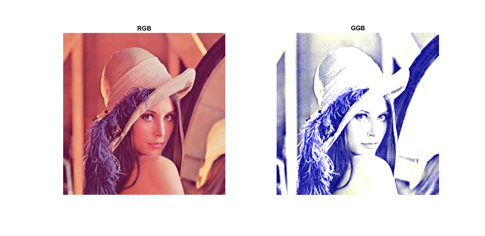
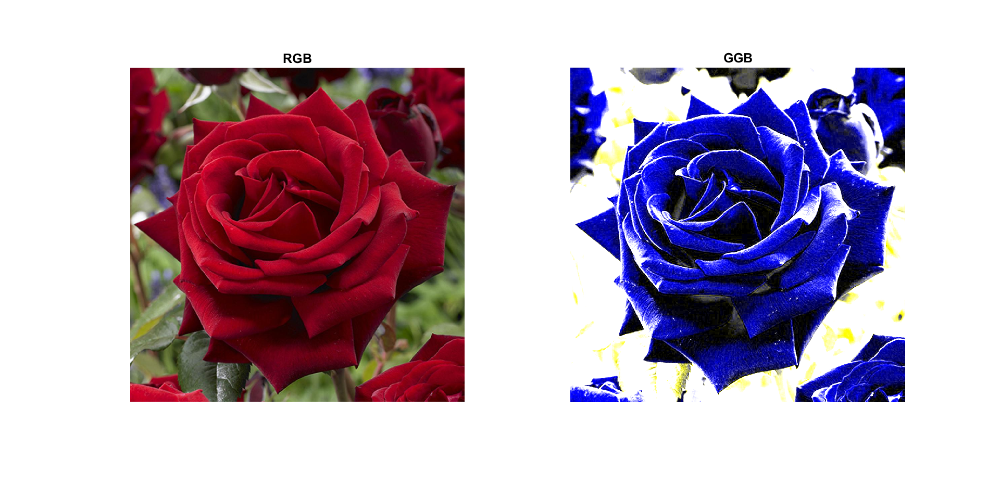
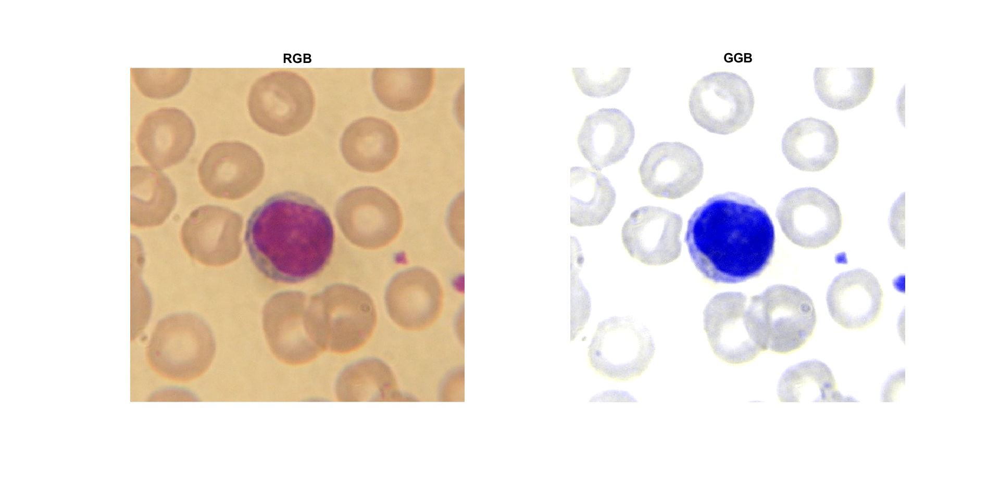

# GGBColorSpace
Implementation of GGB Color Space Using Matlab 

## Getting Started
This project is implementation of GGB Color Space from [Development of a Robust Algorithm for Detection of Nuclei and Classification of White Blood Cells in Peripheral Blood Smear Images](https://link.springer.com/article/10.1007/s10916-018-0962-1).

### Prerequisites
> Project is created with Matlab 2019a.

## Result

### Lenna

### Flower

### Lymphocyte

